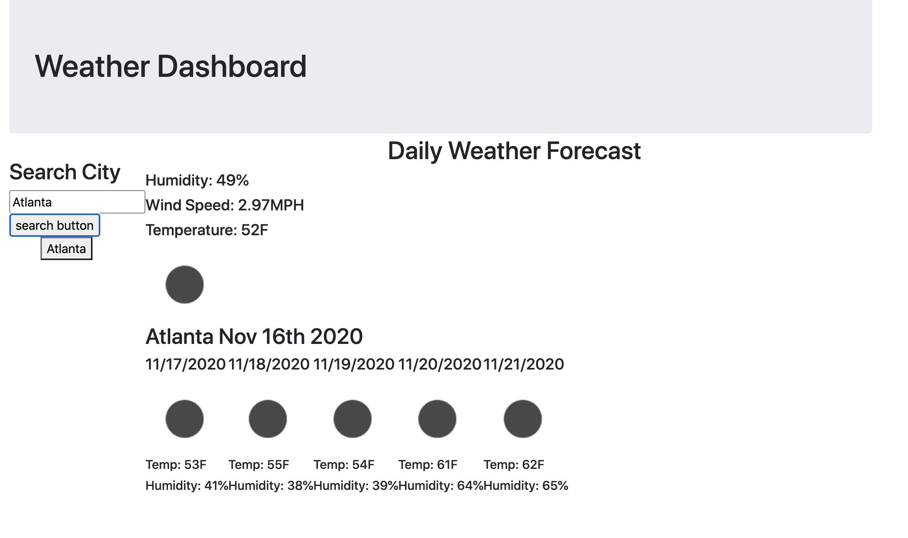

# hw-06-weather-dashboard

## Description

A weather tracker where you can search for a city and get back a single day and five day forecast for that city.

## Table of Contents

- Installation
- Usage
- License
- Contributors
- Tests
- Questions

## Installation

View the app on your local machine or gitHub pages here : https://icecicle04.github.io/hw-06-weather-dashboard/

## Usage

Enter a city you would like to know the weather in and click search.

## Licenses

MIT License

## Contributors

Ali Khan

## Tests

Tested on Local Host and Mongo DB

## Questions

email Ali.Khan4990@gmail.com

